# AgriFair — System Architecture

Paano nagkakadikit-dikit ang mga piraso: tatlong kliyente, isang backend, isang
database, at tatlong panlabas na serbisyo. Ang dokumentong ito ay tungkol sa
**kung ano ang totoong nakasulat sa code**, hindi sa balak — kaya may seksyon sa
dulo para sa mga bagay na nakabitin pa.

- **Repo:** `Captone-Project`
- **Huling na-update:** Set 8, 2026

---

## 1. Ang buong larawan

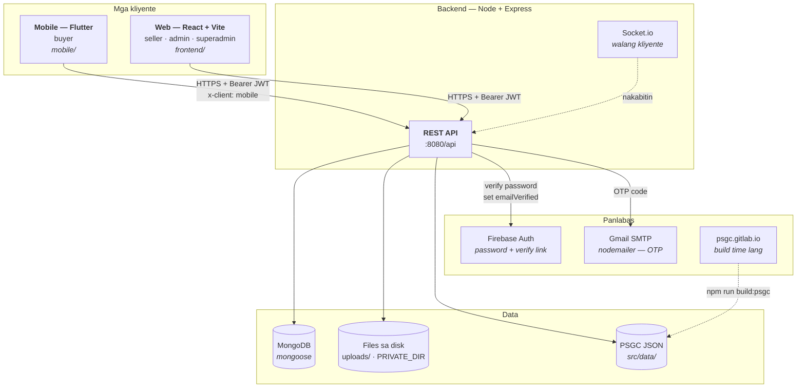

Isang mahalagang detalye: **ang PSGC ay hindi tinatawagan habang tumatakbo ang
system.** Isang beses lang itong kinukuha sa build, isinusulat sa tatlong JSON
file, at binabasa sa memorya pagbukas ng server. Kaya gumagana ang address form
kahit walang internet ang laptop.

---

## 2. Daloy ng isang request

Iisa ang hugis ng lahat ng request. Nakalayer ito nang sadya — ang bawat antas
ay may isang trabaho, at ang database ay hindi kailanman nakikita ng controller.

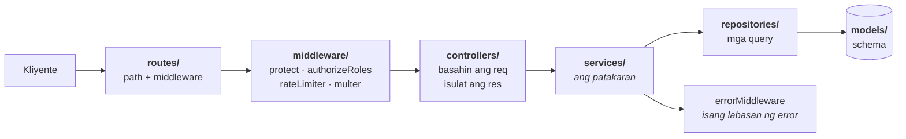

| Layer | Trabaho | Halimbawa |
|---|---|---|
| `routes/` | Anong path, sinong pinapayagan | `cartRoutes.js` |
| `middleware/` | Auth, rate limit, upload | `authMiddleware.js` |
| `controllers/` | `req` papasok, `res` palabas | `chatController.js` |
| `services/` | **Ang mga patakaran** | `cartService.js` |
| `repositories/` | Mga query lang | `cartRepository.js` |
| `models/` | Hugis ng data | `Cart.js` |

Nasa `services/` ang mga desisyon — kung sino ang pwedeng bumili, magkano, at
kung kailan mababawasan ang stock. Kaya kapag may tanong kung *bakit* ganito ang
kilos ng system, doon ang sagot, hindi sa controller.

---

## 3. Pagkakakilanlan — dalawang numero, isang tao

Ito ang pinakamadulas na bahagi ng system, at pinagmulan ng ilang totoong bug.

Ang bawat user ay may **dalawang** pagkakakilanlan:

| | Ano | Saan ginagamit |
|---|---|---|
| `_id` | Mongo ObjectId | Mga ugnayan sa loob ng database — `Conversation.participants`, `Message.sender` |
| `userId` | Numero (1, 2, 3…) | Lahat ng nakikita ng kliyente — JWT, `/chat/send`, `Order.sellerId` |

**Ang alituntunin: ang app ay laging `userId`, ang database ay laging `_id`.**
Kapag naghalo ang dalawa, walang error na lalabas — tahimik lang na hindi
magtutugma ang lahat. Ganito nangyari na ang lahat ng mensahe ay nagmukhang
galing sa kabila: `_id` ang binabasa ng app habang `userId` ang alam nito sa
sarili.

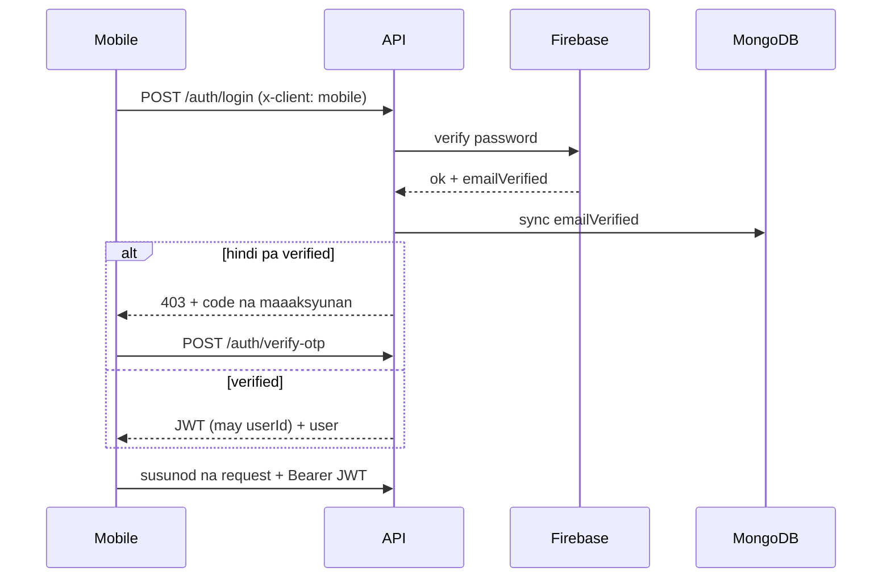

Ang password ay **kay Firebase**, hindi sa Mongo. May bcrypt hash pa rin ang
Mongo bilang offline fallback — kaya ang pagpapalit ng password ay dapat
**sumulat sa dalawa**, kung hindi ay tatanggapin pa rin ang luma.

Ang paraan ng verification ay nakadepende sa kliyente:

| Kliyente | Header | Paraan |
|---|---|---|
| Mobile | `x-client: mobile` | 6-digit OTP sa email (nodemailer) |
| Web | wala | Firebase verification link |

---

## 4. Mula sa pagtingin hanggang sa pagbili

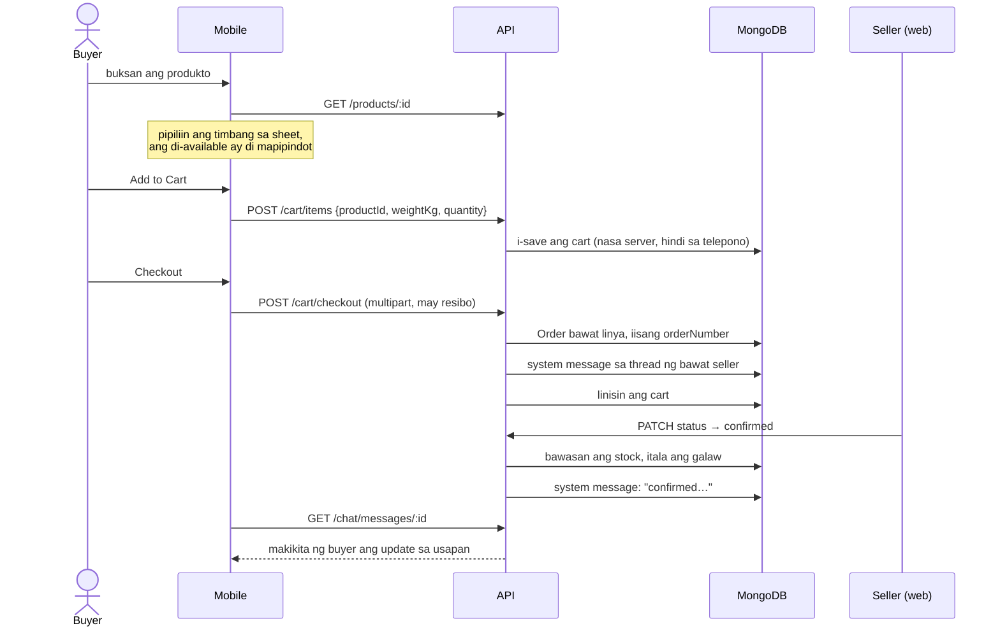

Ilang bagay na sadya:

- **Nasa server ang cart, hindi sa telepono.** Kaya hindi ito nawawala sa
  reinstall at nakikita ng checkout. Muling pinepresyo ito laban sa buhay na
  produkto sa bawat pagbasa, kaya lumalabas agad ang tumaas na presyo o naubos
  na stock.
- **Isang `Order` row bawat linya**, pero iisa ang `orderNumber` at `groupId` —
  magkahiwalay na naghahatid at binabayaran ang mga seller, pero isang resibo
  ang nakikita ng buyer.
- **Kapag nakumpirma pa lang binabawasan ang stock**, hindi sa checkout. Ang
  order na hindi natuloy ay hindi dapat magnakaw ng stock.

---

## 5. Mga mensahe

Tatlong uri ang mensahe, at magkaiba ang kilos ng bawat isa.

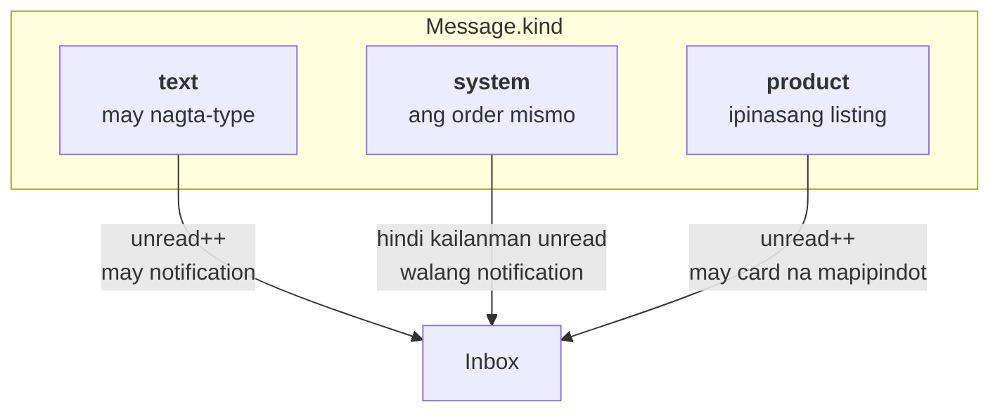

Ang `system` ay hindi tanong — kaya hindi ito naglalagay ng pulang badge. Ang
order na napunta sa "shipped" ay balita, hindi hiling.

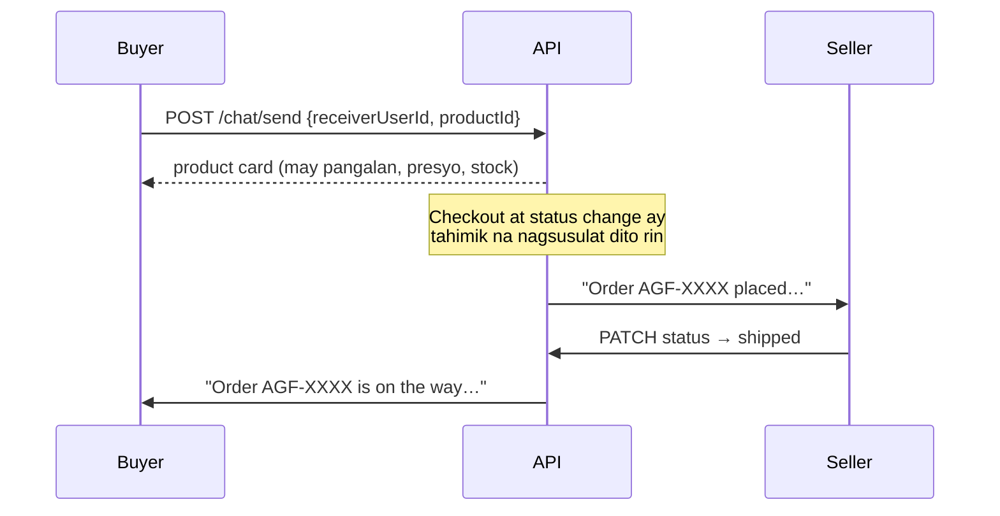

---

## 6. Ang address

Walang hinuhulaan. Tunay na PSGC data ng PSA ang pinanggagalingan.

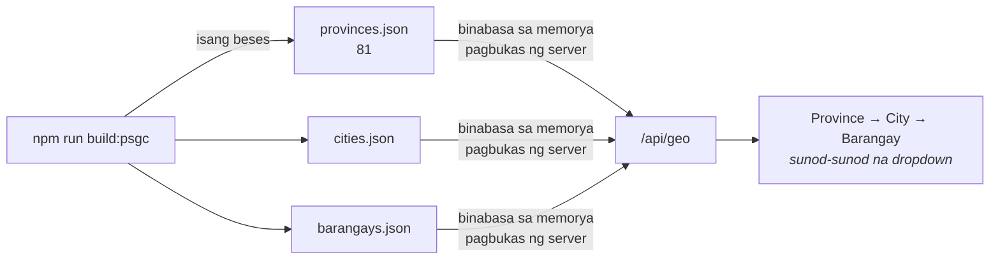

Ang address ay nasa `User.addresses[]`, hindi sa hiwalay na collection.
Sinisiguro ng `addressService.assertOneDefault()` na **laging eksaktong isa** ang
default: ang una ay awtomatikong default, at kapag binura ang default ay may
ibang hahalili.

---

## 6b. Ang paghahatid

Tatlong punto, at ipinapakita ng mapa kung alin man sa kanila ang meron.

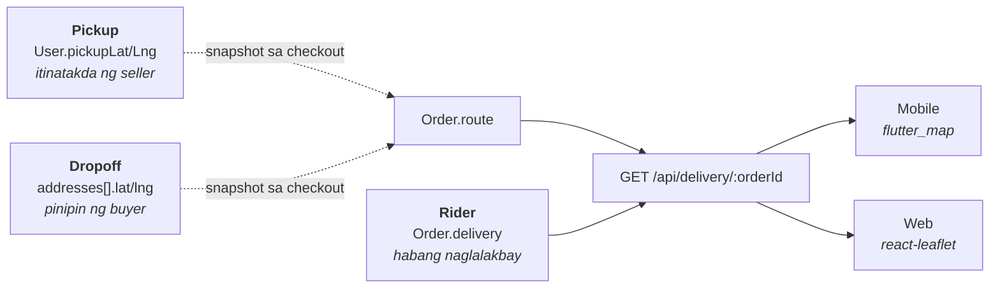

Parehong OpenStreetMap tiles ang ginagamit ng dalawa, kaya **iisang mapa ang
tinitingnan ng buyer at ng seller**, at walang kailangang API key.

Tatlong bagay na sadya:

- **Naka-snapshot sa `Order.route` ang dalawang dulo sa checkout.** Ang buyer na
  nag-edit o nagbura ng address pagkatapos umorder ay hindi dapat makapagpalit
  ng destinasyon ng order na nasa daan na.
- **May fallback ang pickup.** Kapag walang naka-snapshot — order na inilagay
  bago pa nag-pin ang seller — ang kasalukuyang pickup point niya ang tumatayo.
  Kaya ang huling pag-set ay nag-aayos pati sa mga lumang order, hindi lang sa
  mga susunod.
- **Kada order row ang mapa, hindi kada order.** Ang basket na hati sa dalawang
  seller ay dalawang biyahe mula sa dalawang tindahan — ang iisang mapa ay
  kailangang pumili ng isa at magkakamali sa isa.

### Saan nanggagaling ang destinasyon

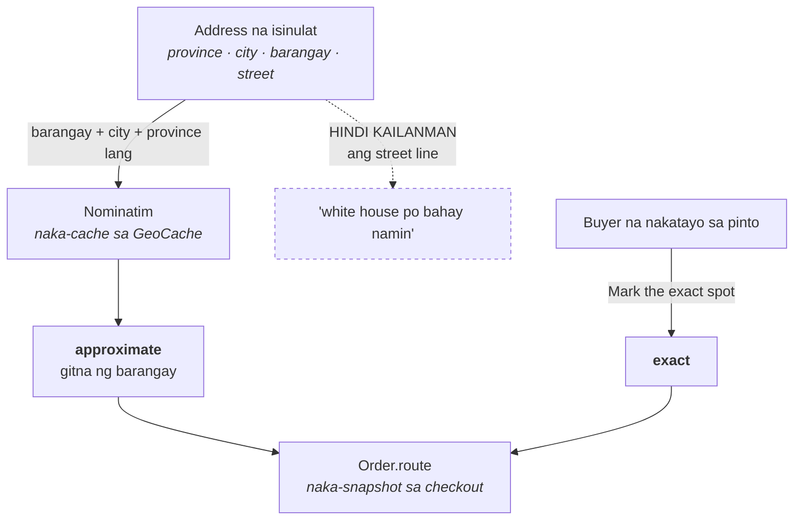

**Ang street line ay hindi kailanman ipinapadala sa geocoder** — tanging ang
tatlong structured na field mula sa PSGC dropdown. Ang "white house po bahay
namin" ay magre-resolve sa lugar na tiyak at mali, at ang rider na nagtitiwala
roon ay mas malalayo pa sa pinto kaysa kung binasa na lang niya ang mga salita.

Barangay ang tamang antas — iyon ang paraan ng paghahatid dito: mapa hanggang
barangay, landmark ang natitira. Nakasulat na "approximate" saanman ito
ipinapakita.

**Hindi rin ito nanggagaling sa kung nasaan ang tao ngayon.** Ang bumibili mula
sa eskwelahan ay hindi dapat mapadalhan sa eskwelahan — kaya ang awtomatikong
daan ay ang address mismo, at ang "Mark the exact spot" ay para lang sa taong
nakatayo talaga sa pinto niya.

---

## 6c. Ang bayad

Walang GCash hangga't walang tumitingin.

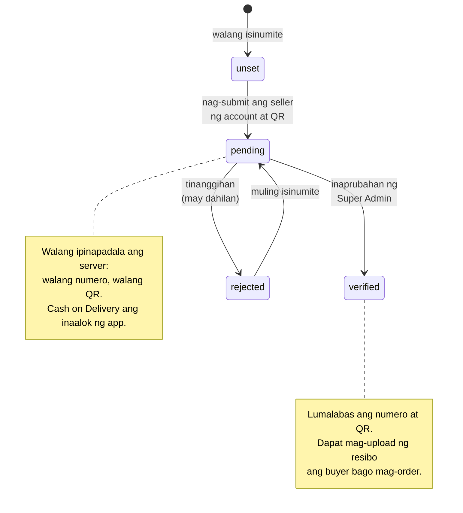

Ang `sellerService.getPaymentDetails` ang tanging pinto, at hindi ito
naglalabas ng anuman maliban kung `payout.status === 'verified'`. Sinasabi nito
kung **alin sa tatlo** ang dahilan — mahalaga iyon, dahil ang seller na
naghihintay ng approval ay dating sinasabihang wala siyang ginawa.

Ipinapatupad sa `cartService.checkout` ang resibo, hindi lang sa screen: ang
naka-disable na button ay kagandahang-loob sa buyer, hindi patakaran.

---

## 6d. Ang mga review

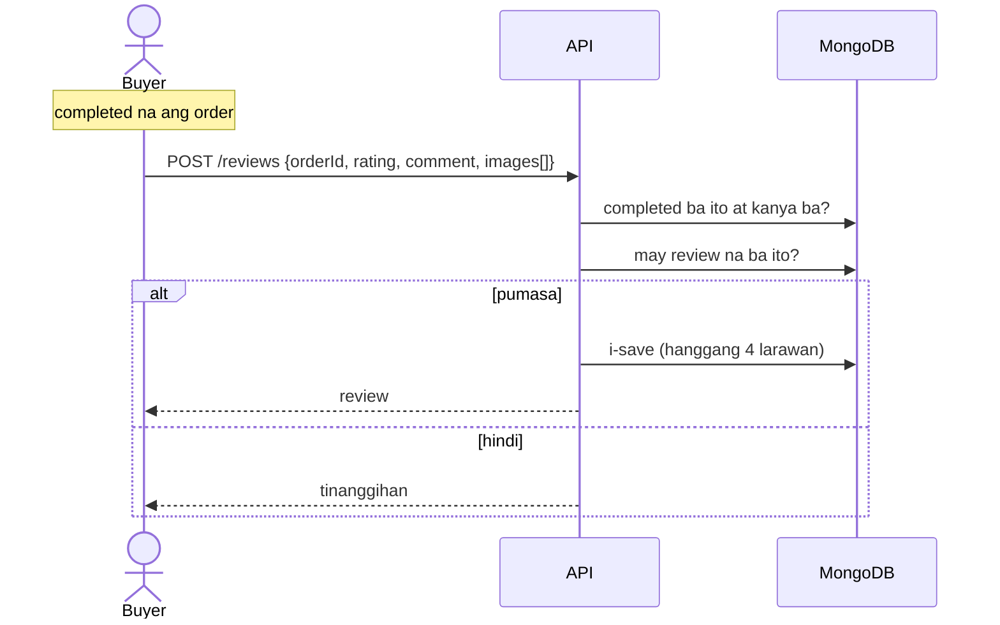

**Laban sa order, hindi sa produkto.** Iyon ang buong garantiya: buyer na
siyang umorder, order na completed na, at isang beses lang. Kaya walang
"Write a review" sa listahan ng review — nagsisimula ito sa mismong order.

Nakatakip ang pangalan (`R**a`): pampublikong tala ng binili ang isang review,
at maliit lang ang mga tindahan dito.

---

## 6e. Ang mga naghahatid

Apat na role na: `superadmin`, `seller`, `buyer`, at `rider`.

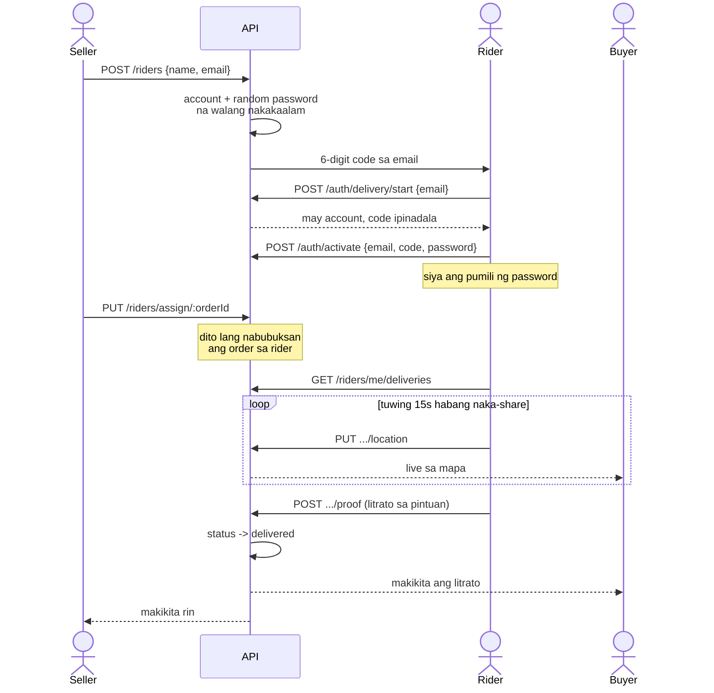

Tatlong bagay na sadya:

- **Hindi alam ng seller ang password.** Random ito at itinapon — hindi dapat
  kayang mag-sign in ng seller bilang tauhan niya.
- **Ang pag-assign ang nagbubukas ng order.** Hindi sapat ang pagtatrabaho sa
  seller; ang pangalan sa order ang nagbibigay ng access, at doon lang.
- **Nasa web ang portal ng rider (`/rider`).** Listahan, link sa mapa, switch
  ng lokasyon, kamera — may browser na ang bawat telepono.

---

## 7. Mga file at privacy

Hindi lahat ng na-upload ay pampubliko.

| Uri | Saan | Sinong nakakakita |
|---|---|---|
| Larawan ng produkto, avatar, larawan sa chat at review | `uploads/media` | Kahit sino — static |
| Resibo ng GCash, QR ng seller, dokumento | `PRIVATE_DIR` | Sa pamamagitan lang ng `/api/files/:name` na may auth |

Apat na tuntunin sa `/api/files`, at bawat isa ay may dahilan:

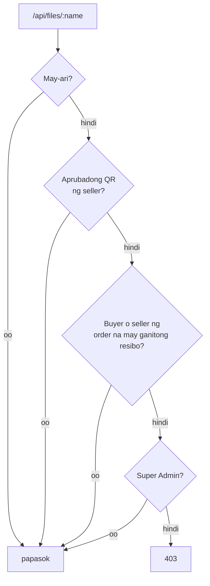

Ang aprubadong QR lang ang bukas sa lahat — pambayad iyon, kailangang makita.
Ang hindi pa aprubado ay credential pa rin. Ang resibo ay para sa dalawang
taong may kinalaman doon: ang nagpadala ng pera at ang dapat tumingin kung
dumating ito.

**Hindi gumagana ang plain `<a href>` o `` dito** — walang
Authorization header ang browser navigation. Kailangang kunin bilang blob
(web) o may `imageHeaders()` (mobile).

Tatlong sadyang pagpigil sa `sellerService`:

- Ang `getPublicProfile` ay naglalabas ng badge at uri ng dokumento — hinding-hindi ang file.
- Ang `getPaymentDetails` ay walang ibinabalik hangga't hindi `payout.status === 'verified'`.
- Ang mga pangalan sa review ay nakatakip (`R**a`).

---

## 8. Kung ano ang tinatago sa buyer

Isang tuntunin, isang lugar: `STOREFRONT_FILTER` sa `models/Product.js`.

```js
{ status: 'active', stock: { $gt: 0 } }
```

Ginagamit ito ng **lahat** ng listahang pambuyer — listing, search, category,
shop ng seller, at ang shop directory. Ang mga kasangkapan ng seller ay
humihiling ng `?includeSoldOut=true`, dahil sila ang kailangang makakita ng
naubos para ma-restock.

---

## 9. Paano nakakarating ang mobile sa backend

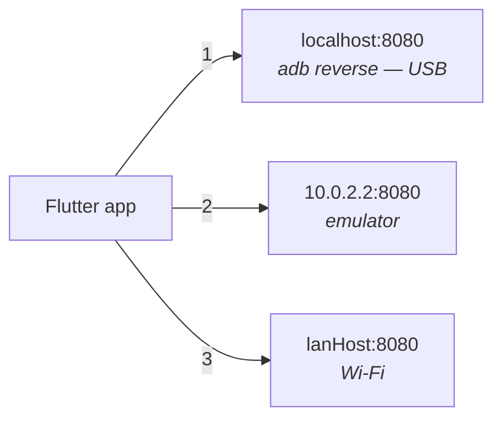

Sinusubukan ng `ApiConfig` ang tatlo ayon sa pagkakasunod at inaalala kung alin
ang sumagot. Nauuna ang USB dahil **wala itong pakialam kung anong network** —
ang LAN address ay ang unang nagiging luma kapag nag-iba ng DHCP.

```
adb reverse tcp:8080 tcp:8080
```

---

## 10. Nakabitin pa

Mga bagay na totoo sa code ngayon at dapat malaman:

- **Tumatakbo ang Socket.io pero walang kumokonekta.** Wala ang `socket.io-client`
  sa `mobile/pubspec.yaml` at sa `frontend/`. Ibig sabihin: **hindi live ang
  mensahe** — kailangang muling basahin ng app. Ito ang susunod na malinaw na
  hakbang para sa chat.
- **Mock pa rin ang notifications sa mobile** — lokal na model, hindi
  `/api/notifications`.
- **Peke ang `ForgotPasswordPage.jsx` sa web** — `setTimeout` lang, walang tunay
  na tawag.
- **Bukas sa kahit sino ang `/api/products/stock/low` at `/stock/out`** —
  nakikita ng kahit sino ang kakulangan sa stock ng seller. Dapat nasa likod ng
  `protect`.
- **Hindi pa nasusubukan nang buo ang GCash** hangga't walang seller na
  `payout.status === 'verified'`.
- **Walang routing sa mapa.** Tuwid na linya ang guhit sa pagitan ng tindahan at
  ng pinto, hindi ang daan na tatahakin — at sinasabi ito ng card sa halip na
  magpanggap.
- **Manu-manong ibinabahagi ng seller ang posisyon.** Walang background
  tracking; pinipindot niya ang "Share my location" habang nasa daan.

---

## 11. Mapa ng mga folder

```
Captone-Project/
├── backend/src/
│   ├── routes/          16 route group, lahat sa ilalim ng /api
│   ├── controllers/     req → res
│   ├── services/        ang mga patakaran
│   ├── repositories/    mga query
│   ├── models/          mongoose schema
│   ├── middleware/      auth · rate limit · upload · error
│   ├── config/          firebase · mailer
│   ├── data/            PSGC JSON (galing sa build)
│   ├── scripts/         buildPsgc · seeder · migrations
│   └── sockets/         socket.io (walang kliyente)
├── frontend/src/        React — seller · admin · superadmin
└── mobile/lib/
    ├── screens/         25 screen
    ├── services/        isang file bawat API area
    ├── models/          data + ChangeNotifier state
    ├── widgets/         clay · sheets · cards
    └── theme/           claymorphism tokens
```

Isang bagay tungkol sa state sa mobile: ginagamit nito ang `ChangeNotifier` +
`InheritedNotifier` (`CartModel.of(context)`), hindi ang `provider` package.
Sadya ito — ito ang pattern na ginamit sa umpisa, at ang paglipat ay
magpapalit ng bawat screen nang walang bagong nakukuha.
